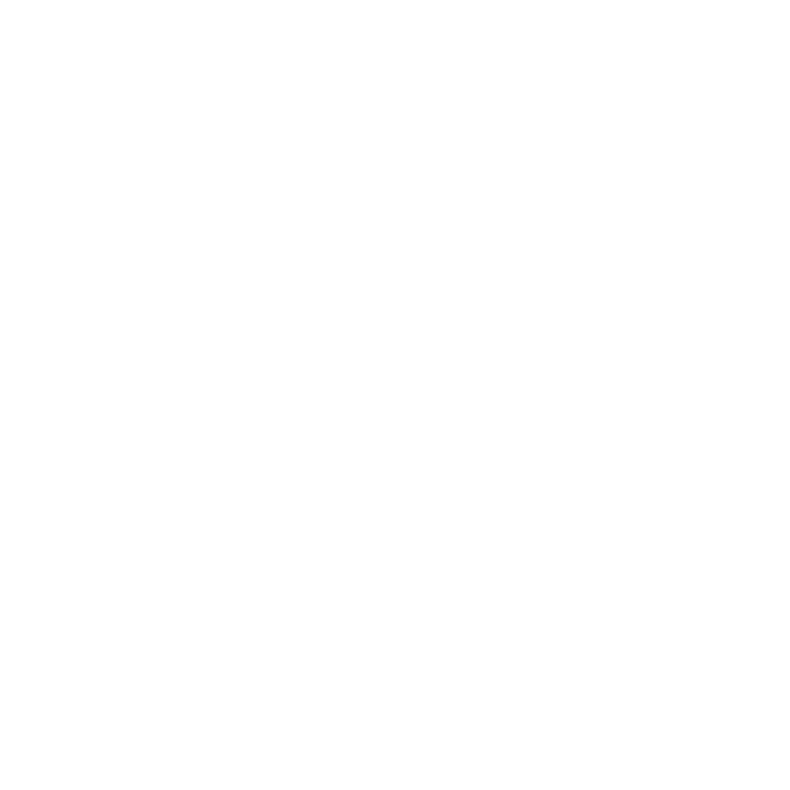

#  RatUI 

RatUI is a Retained-Mode Graphical User Interface library built for C++20.
It's designed for games and aims to integrate into your codebase rather than the other way around.

---

---


## Features

* Retained-mode UI architecture
* Simple, header-only design
* User-defined containers so you can use your own, defaults to std implementations.

Hopefully some soon.

## Repository Structure

 ```bash
RatUI
 ├───Examples      # Example apps using RatUI
 ├───Include/RatUI # Public API (*Note: This is all you need to use this library)
 ├───Scripts       # Build and utility scripts
 └───Tests         # Unit and integration tests
 ```

## Requirements
RatUI is a header-only C++20 library, so all you need to do is:

1. Copy '**Include/RatUI/**' into your project  

TODO: Implement default backends and mention them here

**For examples and tests:**
- C++20‑compatible compiler (GCC, Clang, MSVC)
- [CMake](https://cmake.org/) 3.16+

## Building Tests and Examples from Source

1. **Clone the repository:**

   ```bash
   git clone https://github.com/AsherFarag/RatUI.git
   cd RatUI
   ```

2. **Configure the project with CMake:**

   ```bash
   cmake -B build -S . \
     -DRATUI_BUILD_TESTS=ON \
     -DRATUI_BUILD_EXAMPLES=ON
   ```
   Creates the build system inside build/.
3. **Build the project:**

   ```bash
   cmake --build build
   ```
   *Or*, optionally specify the config:
   ```bash
   cmake --build build --config Debug
   ```

4. **Run Tests (optional):**
   ```bash
   ctest --test-dir build --output-on-failure
   ```

5. **Run Examples:**

   After building, example executables will be located inside the '**build/**' directory.

# Contributing

Contributions are welcome.

For now:
* Open an issue to discuss changes or ideas
* Keep code consistent with the existing style
* Add and ensure tests (if applicable) pass

More detailed guidelines coming soon.

# License

RatUI is licensed under the **MIT License** - see the [LICENSE](https://github.com/AsherFarag/RatUI/blob/main/LICENSE) file for details.
