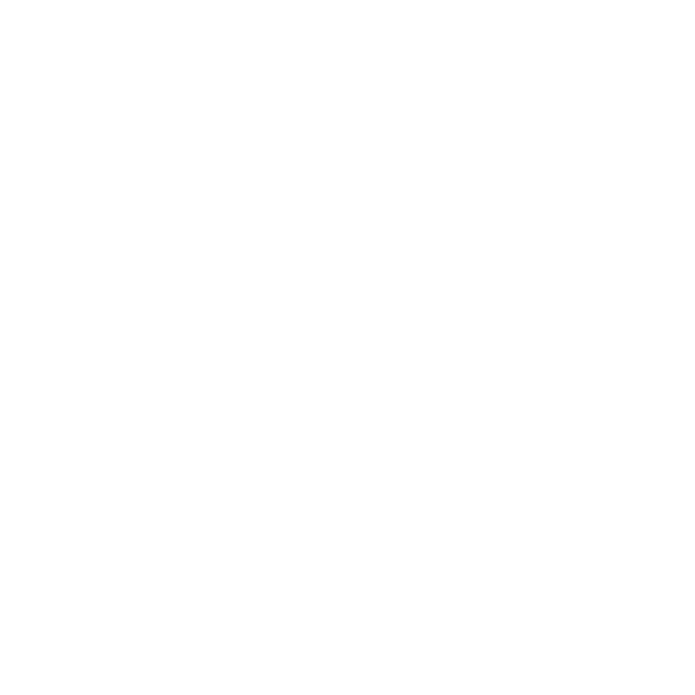

#  RatUI 

RatUI is a Retained-Mode Graphical User Interface library built for C++20.
It's designed for games and aims to integrate into your codebase rather than the other way around.

**[▶ Try Me](https://asherfarag.github.io/RatUI/)** — the examples running live in your browser (WebGL2).

---

---


## Features

* Retained-mode UI architecture
* Math and Container (String, etc) types are user overridable, defaults to STL implementations

Hopefully some soon.

## Repository Structure

 ```bash
RatUI
 ├───Examples      # Example apps using RatUI
 ├───Include/RatUI # Public API (*Note: This is all you need to use this library)
 ├───Scripts       # Build and utility scripts
 ├───cmake         # CMake helper modules and the package config template
 └───Tests         # Unit and integration tests
 ```

## Requirements

**For examples and tests:**
- C++20‑compatible compiler (GCC, Clang, MSVC)
- [CMake](https://cmake.org/) 3.16+ (3.21+ to use the bundled `CMakePresets.json`)

## Example

```cpp
auto renderer = RatUI::OpenGL::OpenGLRenderer{ 1920, 1080 };

auto fontCache = RatUI::FreeType::FontCache{};
fontCache->RegisterFontHandle( FontHandle{1}, "Path/To/Font.ttf" );

auto textMetrics = RatUI::FreeType::TextMetrics{ fontCache };
auto atlas = RatUI::GlyphAtlas{ renderer, textMetrics };
auto drawList = RatUI::DrawList{ atlas };

auto scene = RatUI::Scene{};
scene.TextMetrics = textMetrics;

// TODO Finish this example

```

## Building from Source

Everything is opt-in. A plain configure builds only the header-light core
library and needs no third party dependencies at all:

```bash
git clone https://github.com/AsherFarag/RatUI.git
cd RatUI
cmake -B build -S .
cmake --build build
```

Turn on what you actually need:

```bash
cmake -B build -S . -DRATUI_BUILD_TESTS=ON -DRATUI_BUILD_EXAMPLES=ON
cmake --build build --config Debug
ctest --test-dir build -C Debug --output-on-failure
```

Or use one of the bundled presets (`lib`, `tests`, `examples`, `dev`, `release`):

```bash
cmake --preset dev
cmake --build --preset dev
ctest --preset dev
```

### Options

| Option | Default | Description |
| --- | --- | --- |
| `RATUI_FETCH_DEPENDENCIES` | `ON` (standalone) | Download and build any dependency `find_package()` cannot locate |
| `RATUI_BACKEND_FREETYPE` | `OFF` | FreeType text backend (FreeType + HarfBuzz + msdfgen) |
| `RATUI_BACKEND_OPENGL` | `OFF` | OpenGL renderer backend (GLEW + OpenGL; implies the FreeType backend) |
| `RATUI_BACKEND_BGFX` | `OFF` | bgfx renderer backend |
| `RATUI_BUILD_TESTS` | `OFF` | Build the Catch2 test suite |
| `RATUI_BUILD_EXAMPLES` | `OFF` | Build the examples app (enables the OpenGL backend if no renderer is selected) |
| `RATUI_ENABLE_ASSERTS` | `ON` | Enable RatUI runtime assertions |
| `RATUI_INSTALL` | `ON` (standalone) | Generate install/export rules |

Enabling a backend defines a matching macro on the `RatUI` target
(`RATUI_BACKEND_FREETYPE=1`, `RATUI_BACKEND_OPENGL=1`, `RATUI_BACKEND_BGFX=1`),
so your code can check which ones are available.

### Dependencies

Every dependency is resolved the same way:

1. Use the target if your project already defines it.
2. Otherwise `find_package()` it (system, vcpkg, Conan, ...).
3. Otherwise, if `RATUI_FETCH_DEPENDENCIES=ON`, download and build it.
4. Otherwise fail with a message explaining what is missing.

The fetched versions are pinned in cache variables (`RATUI_FREETYPE_TAG`,
`RATUI_HARFBUZZ_TAG`, `RATUI_MSDFGEN_TAG`, `RATUI_SDL2_TAG`, `RATUI_CATCH2_TAG`,
`RATUI_BGFX_TAG`, `RATUI_GLEW_URL`) and can be overridden on the command line.

> Install rules are skipped automatically when a dependency was fetched, because
> a fetched dependency cannot be exported. Install the dependencies properly to
> produce an installable RatUI package.

### Web (WebAssembly)

The `web` preset builds the examples app with [Emscripten](https://emscripten.org/docs/getting_started/downloads.html)
(needs emsdk activated and Ninja). CI publishes it to GitHub Pages on every push to `main`.

```bash
cmake --preset web
cmake --build --preset web --target RatUI_Examples
python -m http.server -d build/web/Examples   # open RatUI_Examples.html
```

### Using RatUI in your project

With `FetchContent`:

```cmake
include(FetchContent)
FetchContent_Declare(RatUI
    GIT_REPOSITORY https://github.com/AsherFarag/RatUI.git
    GIT_TAG        main)
set(RATUI_BACKEND_OPENGL ON)
set(RATUI_FETCH_DEPENDENCIES ON)
FetchContent_MakeAvailable(RatUI)

target_link_libraries(MyApp PRIVATE RatUI::RatUI)
```

Or against an installed copy:

```cmake
find_package(RatUI REQUIRED)
target_link_libraries(MyApp PRIVATE RatUI::RatUI)
```

# Contributing

Contributions are welcome.

For now:
* Open an issue to discuss changes or ideas
* Keep code consistent with the existing style
* Add and ensure tests (if applicable) pass

More detailed guidelines coming soon.

# License

RatUI is licensed under the **MIT License** - see the [LICENSE](https://github.com/AsherFarag/RatUI/blob/main/LICENSE) file for details.
